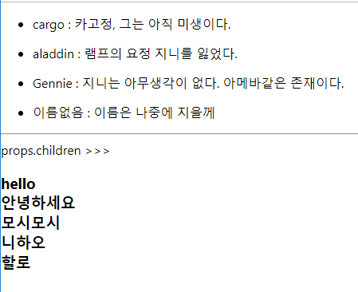

# react 개념정리 (1) - props

react에서 부모컴포넌트에서 자식 컴포넌트로 상태를 어떤 값 또는 데이터를 전달하는 방법은 props를 이용한 방법이 제일 기본적인 방법입니다. 오늘은 props에 대해 정리해보고자 합니다. react로 네이버맵 갖고 놀기에서 사용할 값/데이터 전달 방식이 이 props를 이용한 방식과 state를 이용한 방식이기 때문입니다.

실용적으로 이해하려면 역시 예제 위에서 학습하는것이 좋은 방법일 것 같아 예제를 기반으로 다뤄보겠습니다.


## 1. 예제 프로젝트 생성

예제를 위한 프로젝트 생성을 위해 아래의 명령어를 입력합니다.

```bash
$ cd workspace		# 원하는 디렉터리, 적절한 디렉터리로 이동
$ yarn create react-app props_example	# react 앱 생성 명령어
```

react app의 기초 골격을 만들어주는 명령어인 yarn create react-app 명령어에 대한 설명은 여기서는 건너뛰도록 하겠습니다. 추후에 더 설명할 시간이 생긴다면 자세히 정리해보겠습니다.


## 2. 자식 컴포넌트 생성

### App.js

프로젝트 생성후 초기에 입력되어 있는 샘플 코드는 react에서 공식으로 제공하는 예제입니다. App.js의 내용을 모두 지우고 아래와 같이 render() 함수 내에 아래와 같이 입력해줍니다.

```jsx
import React, { Component } from 'react';
import Child from './Child'
class App extends Component {
  render() {
    return (
      <Child></Child>
    );
  }
}

export default App;
```


### Child.js

자식컴포넌트로 Child.js라는 파일을 생성하고, 아래와 같은 내용을 입력합니다.

```jsx
import React, { Component } from 'react';

class App extends Component {
  render() {
    return (
      <div>{this.props.description}</div>
    );
  }
}

export default App;
```

여기까지의 결과를 yarn start 명령어를 터미널에 입력해 확인해보면 비어있는 화면이 나타날 것입니다.


## 3. App.js에서 Child.js에 props를 통한 값 전달

### App.js

App.js에는 아래의 내용을 입력해줍니다.

```jsx
import React, { Component } from 'react';
import Child from './Child';

class App extends Component {
  render() {
    return (
      <div>
        <Child name="cargo" description="카고정, 그는 아직 미생이다."></Child>
        <Child name="aladdin" description="램프의 요정 지니를 잃었다."></Child>
        <Child name="Gennie" description="지니는 아무생각이 없다. 아메바같은 존재이다."></Child>
      </div>
    );
  }
}

export default App;

```

### Child.js

이번에는 Child.js에 아래와 같은 내용을 입력해줍니다.

```jsx
import React, { Fragment, Component } from 'react';

class Child extends Component {

    render() {
        return (
            <Fragment>
                <ul>
                    <li> {this.props.name} : {this.props.description} </li>
                </ul>
            </Fragment>
        );
    }
}

export default Child;
```

부모컴포넌트에서 name="xxx"와 같이 값을 전달하고 나면 자식 컴포넌트에서 이를 값으로 전달 받아 사용할 때는 this.props.name 이라는 표현으로 부모 컴포넌트에서 전달해준 값을 전달받을 수 있습니다.

결과 화면은 아래와 같을 것입니다.


> props는 읽기 전용입니다. 부모 컴포넌트가 전달해준 값을 읽기전용으로만 사용가능합니다. 단순 데이터 표현을 위해서라면, 복잡한 로직이 필요없다면, 굳이 상태관리 로직을 복잡하게 하지 않고 props로 사용하는 것도 편리한 방법이 될듯합니다.


## 4. defaultProps

자식 컴포넌트 내에서 전달받은 props의 값이 없을 경우에 대한 디폴트 값을 지정해줄 수 있습니다. 자식 컴포넌트 내에 static 키워드와 함께 아래와 같이 입력하면 디폴트 값으로 지정됩니다.

react 내부에서 이것을 어떻게 바인딩하는지 구조는 저도 아직은 모릅니다. 다만 각각의 컴포넌트들 중 부모로부터 props를 전달받아 사용하는 자식 컴포넌트들에 선언된 각각의 defaultProps는 react의 렌더링 엔진이 읽어서 해석하는 것이 아닐까 싶습니다.


```jsx
    static defaultProps = {
        name : '이름없음'
    }
```


위의 내용을 이번 글의 예제에 적용해보면 아래와 같습니다.


### Child.js

```jsx
import React, { Fragment, Component } from 'react';

class Child extends Component {
    static defaultProps = {
        name : '이름없음'
    }

    render() {
        return (
            <Fragment>
                <ul>
                    <li> {this.props.name} : {this.props.description} </li>
                </ul>
            </Fragment>
        );
    }
}

export default Child;
```


달라진것은 크게 없고, static defaultProps = { name : '이름없음 '}; 를 Class내의 멤버필드로 추가했을 뿐입니다.


### App.js

```jsx
import React, { Component } from 'react';
import Child from './Child';

class App extends Component {
  render() {
    return (
      <div>
        <Child name="cargo" description="카고정, 그는 아직 미생이다."></Child>
        <Child name="aladdin" description="램프의 요정 지니를 잃었다."></Child>
        <Child name="Gennie" description="지니는 아무생각이 없다. 아메바같은 존재이다."></Child>
        <Child description="이름은 나중에 지을께"></Child>
      </div>
    );
  }
}

export default App;

```

아랫줄에 \<Child description="이름은 나중에 지을께"\>\<Child\> 를 추가해주었습니다. 


결과화면은 아래와 같습니다.


## 5. props.children

한 컴포넌트안에 children들을 모두 읽어 들일수 있습니다. 자세한 내용은 코드를 봐야 더 이해가 수월할듯 합니다.

### App.js

```jsx
import React, { Component } from 'react';
import Child from './Child';
import Children from './Children';

class App extends Component {
  render() {
    return (
      <div>
        <Child name="cargo" description="카고정, 그는 아직 미생이다."></Child>
        <Child name="aladdin" description="램프의 요정 지니를 잃었다."></Child>
        <Child name="Gennie" description="지니는 아무생각이 없다. 아메바같은 존재이다."></Child>
        <Child description="이름은 나중에 지을께"></Child>
        <hr/>
        <Children>
          <div>hello</div>
          <div>안녕하세요</div>
          <div>모시모시</div>
          <div>니하오</div>
          <div>할로</div>
        </Children>
      </div>
    );
  }
}

export default App;

```

App.js에서는 hr 태그 아래에 아래의 내용만을 추가해주었습니다.

```jsx
        <Children>
          <div>hello</div>
          <div>안녕하세요</div>
          <div>모시모시</div>
          <div>니하오</div>
          <div>할로</div>
        </Children>
```

Children 태그 내에 일반 \<div\> 태그들을  포함시켰습니다.


### Children.js

```jsx
import React, { Fragment, Component } from 'react';

class Children extends Component {
    render() {
        return (
            <Fragment>
               props.children >>> <h3> {this.props.children}  </h3>
            </Fragment>
        );
    }
}

export default Children;
```

결과화면은 아래와 같습니다.



이와 같이 props.children은 자식으로 가지고 있는 컴포넌트들에 접근할 때 사용합니다.


## 6. side study

react를 처음접했을때와 접한지 3개월이 지난 지금도 props라는걸 모르고 그냥 사용법만 익혀서 틈날때마다 뭔가를 만들어보는데에만 사용해왔습니다. props라는게 html의 properties를 의미하는 것 같은데, 찾아봐야지 하면서 차일 피일 미루기만 했었습니다.

오늘 글을 정리하면서 props와 attr의 개념차이를 설명한 글을 찾아보게 되었습니다. 

https://medium.com/@jeongwooahn/html-attribute%EC%99%80-property-%EC%9D%98-%EC%B0%A8%EC%9D%B4-d3c172cebc41

html에서 흔히 말하는 attributes와 properties의 차이점을 정리한 글입니다. 이분 역시 해외 글을 읽고 정리하셨네요.

저는 이분의 글을 짧게 몇줄로만 정리하고 자세한 내용은 위의 링크의 내용으로 대체하려 합니다.


Attribute와 property의 차이는 ?

Attributes는 HTML 텍스트 문서에 있는 것이고 Properties는 HTML DOM 트리 내에 존재하는 것이다. 예를 들면 html 태그 내에 텍스트로 입력한 class="my-class"는 Attribute이고, jquery등을 이용해 props("className") 은 프로펄티 입니다.

attribute는 값이 변하지 않고, properties는 값이 변합니다


