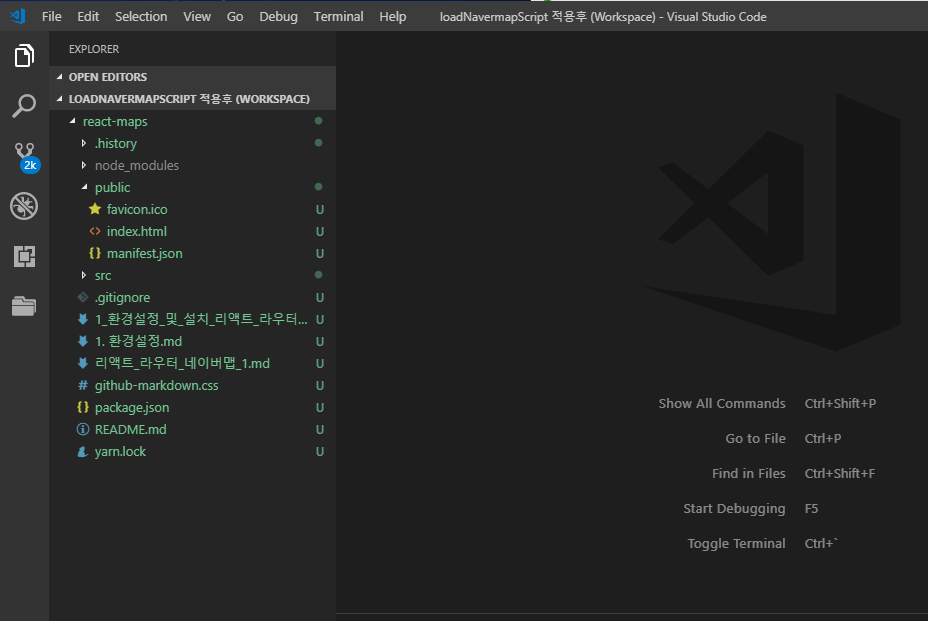
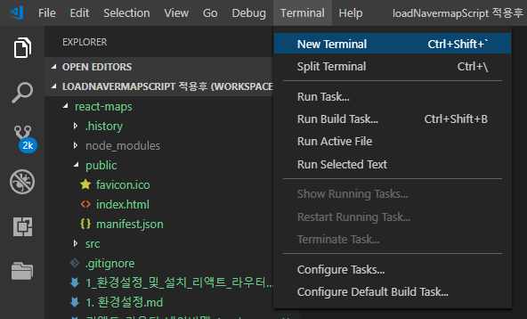
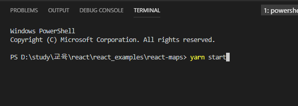
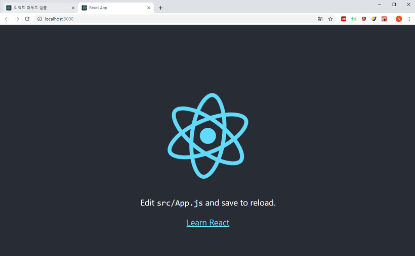
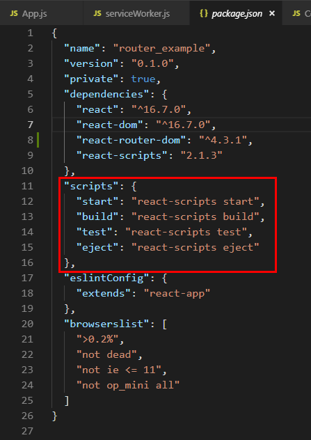
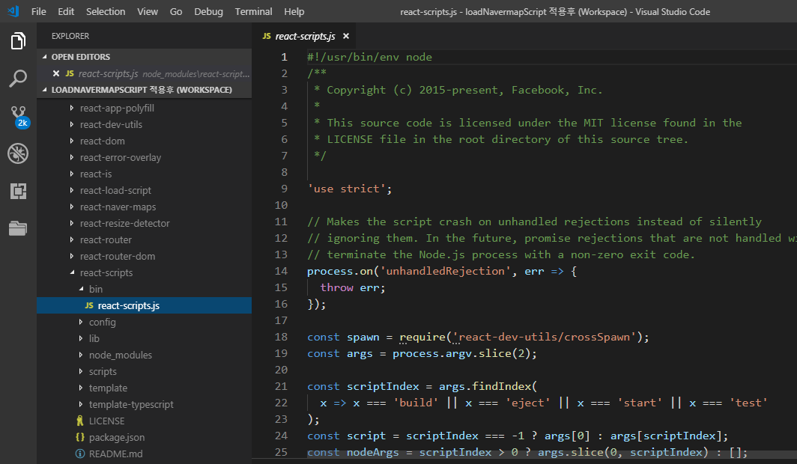
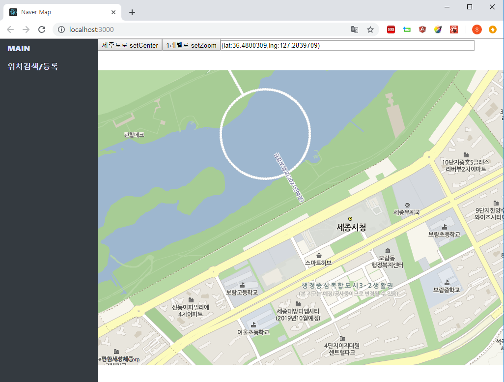
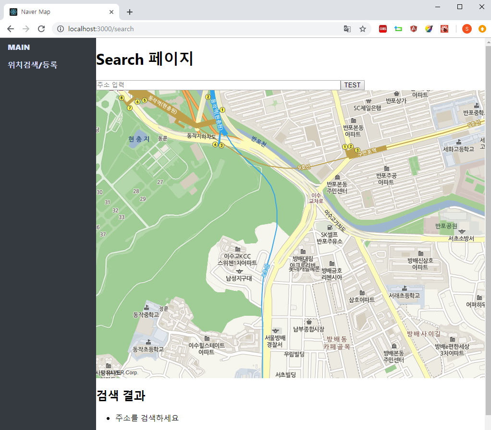
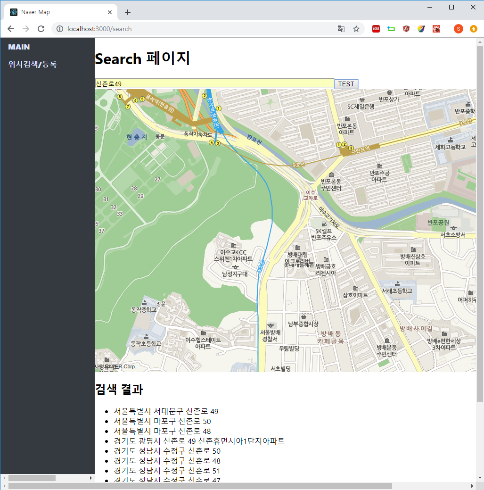
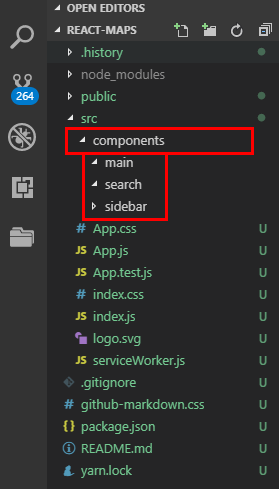

## 1. 환경설정

react 를 클라이언트 환경으로 사용하기 위해서는 Node.js, Yarn, vscode, Node.js 등이 필요합니다.

- Node.js 설치  
   <https://nodejs.org/ko/> 에 접속해서 LTS 버전의 설치파일을 다운받아 설치합니다.
- Yarn 설치  
  <https://yarnpkg.com/en/docs/install#windows-stable> 에 접속하여 Stable버전의 Yarn 다운로드 받아 설치합니다.

- vscode 설치
  https://code.visualstudio.com/ 에 접속하여 vscode를 설치합니다.


>Node.js
>
>- react의 create react-app 명령어를 cli로 사용하려면 node.js의 npm이 필요합니다. 따라서 node.js를 설치해야 합니다. npm만으로 react 앱을 생성할수 있는 것은 npm에 기여한 오픈소스 컨트리뷰터들 덕분이겠죠. 
>
>Yarn
>
>- yarn은 npm을 조금 더 개선해 만든 조금 더 빠른 npm이라고 생각하시면 이해가 빠르실 듯 합니다. react로 프로젝트 초기 구조를 잡을때 npx, yarn을 쓴ㄴ데 그중 yarn을 사용하도록 하겠습니다.
>
>vscode
>
>- vscode는 react 웹/앱을 만들때 많이 사용되는 IDE인데, Windows, Mac, Linux 모든 버전에서 사용가능하도록 만들어진 개발 IDE(무료^^)입니다. vscode외에도 Atom, Sublime Text, Intellij, Webstorm으로 모두 개발 가능합니다. 여기서는 vscode를 이용해 프로젝트를 구성할 예정입니다. 자세한 설명은 생략하겠습니다.


## 2. 프로젝트 생성, 라우트 의존성 추가

react 앱 생성, 라이브러리 의존성을 추가합니다.

적당한 디렉터리를 원하는 위치에 생성하고, 아래의 명령어를 차례로 입력합니다. 저는 프로젝트 명을 react_maps로 했습니다. 

```bash
$ yarn create react-app router_maps
# 프로젝트 생성 명령어 입니다. 명령어의 형식은 yarn create react-app [프로젝트명] 입니다.

$ cd router_map
# 프로젝트 디렉터리로 이동합니다.

$ yarn add react-router-dom
# react 생태계에서 가장 대중적으로 쓰이는 라우팅 라이브러리인 react-router-dom을 다운로드합니다.

$ yarn add qs
# HTML5의 location API를 사용할때 QueryString을 분해하는 유용한 라이브러리를 다운로드합니다. RequestParam과 같은 형태로 url이 구성될때 사용됩니다.

$ yarn add react-naver-maps
# 네이버에서 제공하는 naver map 라이브러리 입니다. 가장 기본적인 기능의 map기능만을 제공합니다. 주소검색을 위해 submodule로 gecoder를 사용하도록 해본 결과 아쉽게도 submodule에 대한 지원은 없습니다. 

# (이 부분에 대해서는 script를 동적으로 생성하는 방법, react-naver-maps 내의 loadNavermapsScript를 사용하는 방법이 있는데 이에 대해서는 추후 다룹니다.)
```


## 3. 프로젝트 실행해보기

생성된 프로젝트 디렉터리인 react_maps를 vscode에서 [File] > [open folder] 를 통해 열어봅니다.



yarn create react-app [원하는 프로젝트명] 으로 생성한 프로젝트 디렉터리를 vscode로 열어본 모습은 위와 같습니다.

이제 vscode 상단의 [Terminal] > [New Terminal...] 을 통해 터미널을 엽니다.




하단에 나타나는 터미널에서 yarn start를 입력해보시기 바랍니다.




yarn start 명령을 실행시키고 나면 아래와 같은 hello world 같은 화면이 나타납니다.



위의 화면은 react에서 공식으로 제공해주는 샘플페이지입니다. 생성된 프로젝트 내에서 App.js App.css를 찾아서 확인해보시면 내부의 내용을 확인하실 수 있습니다. App.js를 로드하는 곳은 index.js입니다. index.js의 내용도 확인해시면 공부에 도움이 되실 듯 합니다.


vscode에서 파일을 찾는 단축키는 Ctrl + P 입니다. Ctrl + P를 눌러서 나온 팝업창에 파일이름을 입력하면 자동으로 이름이 비슷한 파일 혹은 관련 파일들을 추천해주니 이 단축키를 통해 찾으시면 수월할 듯 합니다.


## 4. yarn 스크립트


> yarn start
>
> react-app 프로젝트 디렉터리 내부에서 yarn start 명령을 내리면 내부적으로 개발환경 내에서만 localhost로 웹앱을 구동시킬수 있는 http 서버가 구동되게 됩니다. 처음 보신 분들은 신기하셨을 것 같습니다. 이러한 http 데몬 서버 위에서 개발을 진행하면, 소스상에서 변경된 내용을 저장하고 다른 한쪽에 띄워놓은 브라우저에서 실시간으로 결과를 확인 가능합니다.
>
> 이것이 가능한 이유는 yarn명령어(yarn start)에 대한 스크립트 코드가 미리 작성되어 있기 때문입니다. 보통 이런 yarn 명령어에 대한 start, eject, build, test 와 같은 옵션은 빌드 스크립트로 작성해 구동합니다. 
>
> 우리의 프로젝트에서는 package.json을 찾아보시면 scripts라는 항목에 start, build, test, eject 시에 구동할 스크립트가 명시되어 있습니다.
> 


이제 node_modules/react-scripts/bin/react-script.js를 열어보면



이렇게 되어 있습니다. 빌드 스크립트는 webpack과 관련되어 있다고 하는데, 이 부분은 추후 스크립트를 뜯어보면서 시간이 날때마다 블로그에 정리해볼 예정입니다. 

저도 react와 webpack은 처음입니다. yeoman에서 만든 gulp-angular 프로젝트의 gulpfile 스크립트의 gulp 태스크들을 분석해서 사내에서 리뷰를 진행해본 경험이 있어서, webpack 관련 소스를 분석해보는 것도 흥미로울 것 같습니다.


yarn 의 스크립트 구동 명령어가 어떻게 구성되어 있는지 궁금해서 잠깐동안 찾아본 자료는 아래와 같습니다.

- webpack 만 제대로 맛보기 + yarn 
   https://jinbroing.tistory.com/138
- Yarn 설치 및 사용법  
  https://heropy.blog/2017/11/25/yarn/
- 구글 검색어
  yarn 스크립트


## 4. 페이지 기획

만들고자 하는 페이지의 대강의 모습은 아래와 같습니다.

3월 1일엔 회사일을 하고 어제 부랴부랴 예제를 만들어봤습니다...


**메인 페이지**

입니다. 아직 마커, 마커 클러스터링 기능을 추가하지는 않았지만, 지도의 영역을 클릭시  gps 좌표를 확인하고, 다른 도시로 포커스를 옮기는 기능등을 추가한 상태입니다.

마커, 마커 클러스터링 기능은 3월 중순 쯤에 추가할 듯 싶네요!




**주소검색/등록 페이지**

주소검색/등록 페이지입니다. 지도가 처음 로드될 때 포커스 영역을 임의의 원하는 GPS로 설정해놓았습니다.




**주소검색 후의 결과**

임의의 원하는 주소를 입력하면 아래와 같이 주소가 여러개 나타납니다. 



위와 같은 화면에서 [등록]버튼 기능을 추가해 [등록]버튼 클릭시 GPS 좌표와, 주소명을 Main컴포넌트에게 넘겨주어 MAIN화면에서 의 리스트를 볼수 있도록 추후 발전시켜나갈 예정입니다.


**이슈사항**

이슈사항으로는.... 회사일로 보통 AngularJS/Spring MVC를 사용합니다. AngularJS에서 네이버 맵 연동한 프로젝트의 데모 기능을 작성해본 결과 주소검색, 마커 클러스터링, 마커 표시 등 모든 기능들이 아무 문제 없이 잘 동작했습니다. 

하지만 react의 경우 componentDidMount, componentWillMount등에 별도의 스크립트를 작성해주어야 하더군요. 이러한 문제로 인해 naver에서는 이러한 과정을 모듈화하여  react-naver-map라는 모듈을 npm에 등록했습니다. 

react-naver-map 모듈의 NaverMap 컴포넌트는 submodule을 별도록 props로 넘기지 못하게 되어 있습니다. 해당기능이 막혀있는 것이 아니라. 기본적인 기능만을 제공하기 때문에 submodule이라는 props에 대한 고려자체가 서비스 제공의 주요사안이 아니었던거 같습니다.


## 5. 프로젝트 구조

src 디렉터리 밑에 컴포넌트들을 담아두는 components라는 디렉터리를 생성하고 components 디렉터리 밑에는 main, search라는 디렉터리를 만들어 둡니다.


생성할 디렉터리들의 구조는 아래와 같습니다.

```bash
router_example
|_....
|_src
   |_components     # 생성할 디렉터리 (생성해줍니다. 이름은 무관)
   |    |_main           # 생성할 디렉터리 (생성해줍니다. 이름은 무관)
   |    |_search         # 생성할 디렉터리 (생성해줍니다. 이름은 무관)
   |- App.js
   |- App.css
   |- ...
```


위와 같이 생성한 프로젝트 내의 디렉터리 구조는 아래와 같습니다.




## 6. UI 기본구조 세팅(index.js, App.js, Sidebar.css )

src/components/sidebar 디렉터리에 sidebar.css 파일을 생성합니다. 내용은 아래와 같습니다.. 구체적인 내용은 생략하겠습니다.

```css
* 왼쪽 사이드바 */
.all{
display: inline;
}
.sidebar {
/* div 가로 정렬 */
display:inline;
float:left;
width:300px;

/* background-color 지정 */
background-color: #343a40;

/* 왼쪽 전부 차지하도록 */
position: fixed;
overflow: auto;
height: 100%;
}

/* 오른쪽 컨텐츠 영역 */
/* http://alik.info/p/7 */
.page-area {
/* div 가로 정렬 */
display:inline;
position: absolute;
width:auto;
margin-left:300px;
height:100%;
float: right;
}

.sidebar > ul{
list-style-type: none;
margin: 0;
padding: 0;
}
.sidebar > ul > li a {
display: block;
width: 300px;
color: #000;
padding: 8px 16px;
text-decoration: none;
font-weight: 900;
color: #dbe4ff;
}
.sidebar > ul> li a:hover{
background-color: #555;
color: white;
}

.sidebar > ul > li .active{
background-color: #4CAF50;
color: white;
}
```


ss, html 이 제 전문분야가 아니라서

- div 나란히 놓는 방법 (국내 블로그)
- css 메뉴 바 만들기 (w3cschool)

등을 검색하고 만들어보면서 참고해서 만든 css 파일입니다. 해당 참고 자료 URL은 이번글의 하단에 명시하도록 하겠습니다.


**index.js**

react의 라우터인 react-router를 사용하기 위해서는 index.js파일에서 <BrowserRouter> 컴포넌트로 <App> 컴포넌트를 감싸주어야 합니다. 

그리고, 네이버 맵을 사용하기 위해 BrowserRouter와 App 사이에 RenderAfterNavermapsLoaded 컴포넌트로 감싸줍니다.

```javascript
import React from 'react';
import ReactDOM from 'react-dom';
import './index.css';
import App from './App';
import * as serviceWorker from './serviceWorker';
import {BrowserRouter} from 'react-router-dom';
import {RenderAfterNavermapsLoaded} from 'react-naver-maps';

ReactDOM.render(
    <BrowserRouter>
        <RenderAfterNavermapsLoaded ncpClientId='7fsdkjz4mn'>
            <App />
        </RenderAfterNavermapsLoaded>
    </BrowserRouter>, 
    document.getElementById('root'));

// If you want your app to work offline and load faster, you can change
// unregister() to register() below. Note this comes with some pitfalls.
// Learn more about service workers: http://bit.ly/CRA-PWA
serviceWorker.unregister();

```


- import {BrowserRouter} from 'react-router-dom'; 
  react-router-dom이라는 이름의 .js파일에서 BrowserRouter라는 컴포넌트를 얻어와 import 하는 구문입니다.

  

- <BrowserRouter> <App/> </BrowserRouter>
  <App/>하나만 사용하던 ReactDOM.render( ...) 구문을 위와 같이 <App/>을 <BrowserRouter></BrowserRouter>가 감싸주도록 변경합니다.

react에서 라우터를 사용하기 위해서는 다소 번거롭지만 App 컴포넌트를 BrowserRouter 컴포넌트가 감싸도록 변경해줘야 합니다.


**App.js**  

App.js의 내용은 아래와 같습니다.

```javascript
import React, { Component } from 'react';
import logo from './logo.svg';
import './App.css';
import {Sidebar} from './components/sidebar/Sidebar.css';
import {Route,Link} from 'react-router-dom';
import MainPage from './components/main/MainPage';
import Search from './components/search/Search';
// import {Search} from './components/search/Search';


class App extends Component {
  render(){
    return(
      <div className="all">
        <div className="sidebar">
          <ul>
            <li><Link to="/">MAIN</Link></li>
            <li><Link to="/search"> 위치검색/등록 </Link></li>
          </ul>
        </div>
        <div className="page-area">
          <Route path="/" exact={true} component={MainPage}></Route>
          <Route path="/search" component={Search}></Route>
        </div>
      </div>
    );
  }
}

export default App;

```

- <Link to ... >
  <Link> 컴포넌트는 특정 url로 이동하도록 해주는 컴포넌트입니다. html의 a태그에서 href가 하는 역할과 유사한 역할을 하지만, 파라미터 전달 및 상태 전달을 한다는 점에서 확장된 기능을 제공합니다. Link컴포넌트 역시 컴포넌트이므로 props로 데이터를 전달해줄 수 있습니다.

- \<Route path = "/" component={some component} \></Route>
  Route 컴포넌트는 Link 컴포넌트에 명시해둔 경로에 대해 어떤 컴포넌트를 연결해줄지를 명시하는 컴포넌트입니다.  Link태그를 클릭했을때 위에 명시한 

  \<div className="page-area"\> ... \</div\> 내부의 내용이 해당 \<Route component = {...}\> \</Route> 태그 내부에 명시한 컴포넌트에서 rendering하고 있는 내용으로 변경됩니다.


여기까지는 App.js와 가장 최소화된 css를 적용해서 프로젝트를 만드는 과정을 정리했습니다. App.js의 역할은 project의 root역할이라고 생각하시면 됩니다. 아직까지는 MainPage, Search페이지를 만들지는 않았기 때문에 네비게이션 바만 보이실 겁니다. 링크를 클릭해도 해당 페이지로 넘어가지는 않을 거구요.

다음 글에서 MainPage.js의  구조를 설명하도록 하겠습니다. 여기서는 naver map api를 

- react-naver-maps 

컴포넌트를 활용해 기본적인 역할만을 수행하도록 해보겠습니다.


