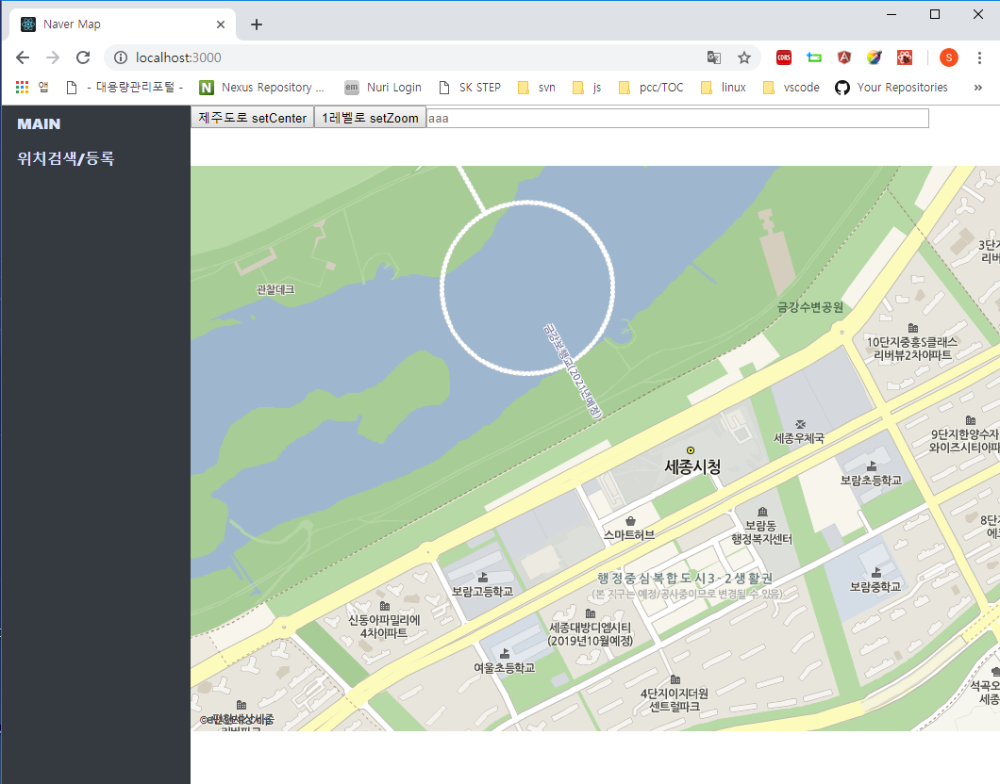

# 0. react에서의 Naver Map 연동

react에서 Naver Map을 연동하는 방법은 다른 방법들도 있겠지만 제가 수행해봤던 방법은 두가지 입니다. 그리고 오늘 글에서 다룰 내용은 가장 쉽고 간편한 첫번째 방식입니다.

1. **react-naver-maps 라이브러리 활용**
   yarn add react-naver-maps를 통해 다운로드 가능합니다.
   단점은 주소 검색 등 submodule을 사용해야 하는 기능에 대해서는 지원이 되지 않습니다. 
   (회사 프로젝트를 react로 하고 있다면 네이버 맵 npm 리포지터리에 공식으로 문의를 하겠지만, 아직은 개인용으로만 react를 사용하고 있어서리 아직 별달리 불편하지 않아서 문의를 하지 않았습니다.)

2. **\<script\> 태그 동적 생성**

   index.html에 \<script\> 태그로 네이버 맵 cdn을 텍스트로 추가할 경우 페이지 로딩시 에러가 발생합니다. 새로고침을 하면 잘 보이긴 하지만 처음 접속시 에러가 납니다. 

   이런 문제는 componentWillMount, componentDidMount 등의 LifeCycle API내에서 동적으로 script를 띄우면 해결됩니다. 이에 대해서는 다음글에서 주소검색 컴포넌트를 만들어보면서 다루게 될듯합니다. (참고로 componentWillMount는 최근 버전의 react에서는 지원되지 않는다고 하네요.)


# 1. 네이버 맵 컴포넌트 연동하기

여기서는 사용할 맵 컴포넌트는 Naver에서 개발한 컴포넌트를 사용할 예정입니다. 

터미널에서 프로젝트를 생성한 디렉터리로 이동하시고 아래와 같이 명령어를 입력하시기 바랍니다.

```bash
$ yarn add react-naver-maps
```


react naver map 개발자센터의 주소는 아래와 같습니다.

https://www.npmjs.com/package/react-naver-maps


# 2. index.js, App.js

### index.js 

```javascript
import React from 'react';
import ReactDOM from 'react-dom';
import './index.css';
import App from './App';
import * as serviceWorker from './serviceWorker';
import {BrowserRouter} from 'react-router-dom';
import {RenderAfterNavermapsLoaded} from 'react-naver-maps';

ReactDOM.render(
    <BrowserRouter>
        <RenderAfterNavermapsLoaded ncpClientId='꼭 clientId를 발급받아서 이곳에 입력하세요'>
            <App />
        </RenderAfterNavermapsLoaded>
    </BrowserRouter>, 
    document.getElementById('root'));

// If you want your app to work offline and load faster, you can change
// unregister() to register() below. Note this comes with some pitfalls.
// Learn more about service workers: http://bit.ly/CRA-PWA
serviceWorker.unregister();

```

- react-naver-maps를 사용하기 위해서는 \<RenderAfterNavermapsLoaded\> 컴포넌트로 \<App\> 컴포넌트를 감싸주어야 합니다. 


### App.js 

App.js의 내용을 다시 다뤄보겠습니다.

```javascript
import React, { Component } from 'react';
import logo from './logo.svg';
import './App.css';
import {Sidebar} from './components/sidebar/Sidebar.css';
import {Route,Link} from 'react-router-dom';
import MainPage from './components/main/MainPage';
import Search from './components/search/Search';
// import {Search} from './components/search/Search';


class App extends Component {
  render(){
    return(
      <div className="all">
        <div className="sidebar">
          <ul>
            <li><Link to="/">MAIN</Link></li>
            <li><Link to="/search"> 위치검색/등록 </Link></li>
          </ul>
        </div>
        <div className="page-area">
          <Route path="/" exact={true} component={MainPage}></Route>
          <Route path="/search" component={Search}></Route>
        </div>
      </div>
    );
  }
}

export default App;

```

- <Link to ... >
  <Link> 컴포넌트는 특정 url로 이동하도록 해주는 컴포넌트입니다. html의 a태그에서 href가 하는 역할과 유사한 역할을 하지만, 파라미터 전달 및 상태 전달을 한다는 점에서 확장된 기능을 제공합니다. Link컴포넌트 역시 컴포넌트이므로 props로 데이터를 전달해줄 수 있습니다.

- \<Route path = "/" component={some component} \></Route>
  Route 컴포넌트는 Link 컴포넌트에 명시해둔 경로에 대해 어떤 컴포넌트를 연결해줄지를 명시하는 컴포넌트입니다.  Link태그를 클릭했을때 위에 명시한 

  \<div className="page-area"\> ... \</div\> 내부의 내용이 해당 \<Route component = {...}\> \</Route> 태그 내부에 명시한 컴포넌트에서 rendering하고 있는 내용으로 변경됩니다.

  

위에서 작성한 App.js에 링크가 걸려있는 컴포넌트들중 오늘 우리는 MainPage 컴포넌트를 다뤄보겠습니다.


# 3. MainPage.js

기본 지도를 띄우는 것은 그리 어려운 작업이 아닙니다. 네이버 개발자 센터의 글을 읽고 하면 되기 때문에 어려운 작업은 아닙니다. react에서 실행하는게 쉬운 작업은 아니었지만, 구글링을 하면서 알게된 react-naver-maps를 활용해 띄웠고, 기본적인 코드예제들은 react-naver-maps 공식 npm 리포지토리를 참고하면 많은 예제들을 접하실 수 있을 것입니다. 


```javascript
import React, { Component, Fragment } from 'react';
import {loadNavermapsScript, NaverMap} from 'react-naver-maps';
// import {NaverMap, RenderAfterNavermapsLoaded} from 'react-naver-maps';

class MainPage extends Component {

    // map = new naver.maps.Map('mapDiv', {option});
    constructor(props){
        super(props);
        const navermaps = window.naver.maps;
        this.state = {
            map: navermaps,
            input_latlng: '',
            zoomControl : true,
            zoom:2,
            mapTypeId: 'normal',
            center : navermaps.LatLng(36.4800580, 127.289039), // 126.9861108, 37.4983439
            zoomControlOptions: {
                center: new navermaps.LatLng(36.4800580, 127.289039), //36.4203004, 128.317960
                position: navermaps.Position.TOP_LEFT,
                style: navermaps.ZoomControlStyle.SMALL
            },
            scaleControl: true,
            draggable: true,
            scrollWheel: true,
            bounds: null, 
            jeju : navermaps.LatLng(33.3590628, 126.534361),
            dokdo : navermaps.LatLngBounds(
                navermaps.LatLng(37.2380651, 131.8562652),
                navermaps.LatLng(37.2444436, 131.8786475)
            ),
            seoul : navermaps.LatLngBounds(
                navermaps.LatLng(37.42829747263545, 126.76620435615891),
                navermaps.LatLng(37.7010174173061, 127.18379493229875)
            ),
            busan: navermaps.LatLng(35.1797865, 129.0750194)
        };
    }

    handleClick = (e) => {
        console.log('e.coord >>>', e.coord );
        this.setState({
            input_latlng: e.coord + ''
        });
    }

    handleToJeju = (e) =>{
        // let map = window.naver.maps.Map;
        let map = this.state.map;
        console.log('maps >>>', map);
        console.log('navermaps >>> ', window.naver);
        // map.setCenter(this.state.jeju);
        this.setState({
            center: this.state.jeju
        });
    };

    handleToZoomLevelOne = (e) =>{
        this.setState({
            zoom: 10
        });
    }

    render() {
        return (
            <Fragment>
                <div style={{width:'100%'}}>
                <NaverMap id="mapDiv" style={{width : '100%',height:'600px', top: '40px'}}
                    onClick={this.handleClick}
                    center={this.state.center}
                    bounds={this.state.bounds}>
                </NaverMap>
                </div>
            </Fragment>
        );
    }
}

export default MainPage;
```


### 주요 개념 설명

- **Component, Props**
  react에서는 html 앨리먼트 뒤에 onClick, style, 등을 지정하여 사용하는데 onClick, style 과 같은 것을 Props라고 합니다. 처음 접하는 분들은 멘탈붕괴를 겪으실수 도 있습니다. jquery 등을 이용해 DOM조작을 할때는 컴포넌트, Props라는 개념이 없기 때문입니다.

  Props를 간략하게 설명하면, Props는 부모 컴포넌트와 자식 컴포넌트 사이에 값을 전달받는 방식 중의 하나입니다. 자세한 설명은 
  https://velopert.com/921
  을 참고하시면 이해하기 수월하실 것 같습니다.

  

- **constructor 란?**
  es6에서부터 추가된 생성자 구문입니다. 기존의 prototype을 이용해 함수들을 선언하고 생성자를 할당하시던 분들은 생소하실 수도 있습니다. es6이전의 constructor 구문과 es6에서의 constructor 구문에 대해 아래에서 자세히 다루도록 하겠습니다.

- **render()함수**

  react모듈로부터 import하는 모든 component들은 render(), componentDidUpdate() 등의 LifeCycle API를 오버라이딩 하게 됩니다. 이중 render()라는 함수를 오버라이딩하게 되면 react에서는 컴포넌트가 마운트 된 후에 render()에서 무슨동작을 하는지 자세히 파악할 필요 없이 호출을 수행합니다.

  react의 LifeCycle API에 대해서는 
  https://velopert.com/3631
  에서 자세히 다루고 있습니다. 

- **'onClick' props**
  html의 각 요소마다 존재하는 onclick 이벤트 속성은 react에서는 onClick이라고 지정하여 사용합니다. onClick프로퍼티에 이벤트 핸들러를 전달하고자 할때는 {}기호 내에 함수의 메모리주소, 즉 변수로 전달해야 합니다. 
  짧게 설명하면, 함수를 변수로 전달해야 합니다. 함수의 호출을 전달하거나 하면, 정상적인 동작이 되지 않을 수 있습니다.

- **'style' props**

  react에서는 style도 객체로 다룹니다. {} 내에 json형식으로 {width: 100%} 와 같이 지정해두었는데, style 프로퍼티 내에 json을 전달한 것으로 생각하시면 됩니다.

- **'center', 'bounds' props**

  center, bounds props는 react-naver-maps에서 제공하는 props입니다. 아쉽게도 아직 submodule을 props로 제공해주지 않고 있네요.
  


# 4. 소스 설명


# 5. constructor

https://poiemaweb.com/es6-class


# 6. 결과화면

결과화면은 아래와 같습니다.




# 7. 다음글에서는 ... 

다음글에서는 주소 검색을 다뤄보고자 하는데... 선뜻 엄두가 안나네요. 막상 개인 시간에 예제를 따로 만들어 볼때는 소스가 깔끔해야 한다는 압박감 없이 진짜 막 만들었습니다. 그래서 인지소스의 양이 많습니다. 컴포넌트로 분리하고 props로 데이터를 교환하는 부분도 있습니다... 어떻게 정리해야 할지 어떻게 설명해야할 지 감이 안오고 있습니다.ㅋㅋ

처음 호기심에 신기한 걸 만들어볼 때는 좋았습니다. 근데 이걸 기록으로 남겨두고 싶어서 막상 일을 저질르고 나니... 내가 왜 그랬을까? 하는 후회가...흠흠.. 아무튼... 시간이 허용하는 선에서 정리를 해보게 될듯하네요. 


