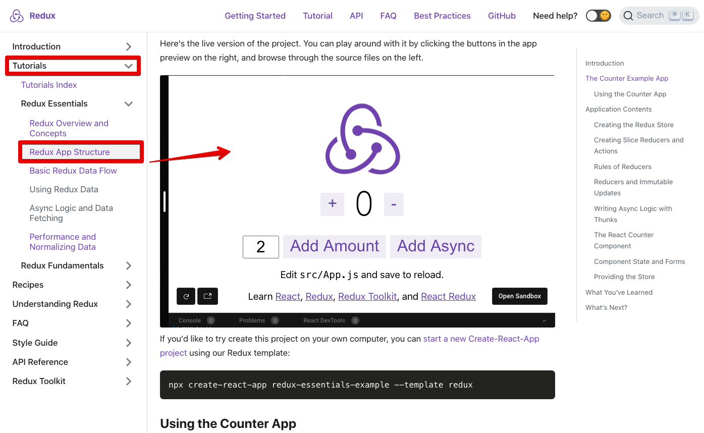

This project was bootstrapped with [Create React App](https://github.com/facebook/create-react-app), using the [Redux](https://redux.js.org/) and [Redux Toolkit](https://redux-toolkit.js.org/) template.

# 단순무식 + 직관적 카운터 redux 예제

# 예제 출처

이 예제는 Redux 공식 페이지에서 제공하는 예제([Redux.js.org - Redux App Structure](https://redux.js.org/tutorials/essentials/part-2-app-structure))를 활용했다.  
보통 대부분의 유명 라이브러리들은 한국어 사이트도 제공하는 경우가 많은데 Redux의 경우 한국어 사이트가 없다.    

아쉬운 대로 정리를 시작해보려 한다.   
개인이 정리를 하게 되면 어느정도의 의견 또는 시각이 섞여서  
더 간단하게 정리할 수 있게 되는 경우도 있기에 나름 장점이 되지 않을까싶다.  

Redux App Structure (이 예제에서 정리하고 있는 문서)
- [Redux.js.org - Redux App Structure](https://redux.js.org/tutorials/essentials/part-2-app-structure))

redux 공식 도큐먼트
- [react-redux.js.org](https://react-redux.js.org/)

참고해볼만한 다른 자료
- [Redux Fundamentals, Part5: UI and React](https://redux.js.org/tutorials/fundamentals/part-5-ui-react)
    - Todo list 기반 예제

https://redux.js.org/tutorials/essentials/part-1-overview-concepts#how-to-read-this-tutorial


# 예제 찾아가는 법
처음 공부할때 redux 공식 페이지를 기웃기웃 거리다가..   
뭐야? 찾기 어렵네... 하고 덮기를 몇수십번을 반복했는데... 혹시라도 이 글을 보게 되는 익명의 사람들은 나처럼 문턱에 여러번 걸리지 않고 순풍순풍 소설책 읽듯이 학습했으면 좋겠다.    

리덕스 공식 튜토리얼은 마치 왕좌의 게임 드라마를 완주하거나 해리포터 소설을 읽는 것처럼 퍼즐을 맞춰나가는 재미가 있다. 직접 따라해보다보면 느낄수 있다.   
영어공부도 하고 일타쌍피다~


# 프로젝트 생성
```bash
$ yarn create react-app redux-essential-counter --template redux
$ cd redux-essential-counter
```

# 프로젝트 실행
```bash
$ yarn start
```

# Redux Dev Tools 설치 및 사용법
이 부분은 추후 정리할 예정이다.😅😅😅

# Application Contents
애플리케이션의 구조는 아래와 같이 구성되어 있다. 한눈에 살펴보게 정리하면 아래와 같은 구조이다.
- `/src`
    - `index.js` : application 의 진입점(starting point)
    - `App.js` : 최상위 계층의 리액트 컴포넌트
    - `/app`
        - `store.js` : Redux 스토어 인스턴스를 생성하는 역할을 한다.
    - `/features`
        - `/counter`
            - `Counter.js` : 리액트 컴포넌트이다. 카운터 UI 컴포넌트 역할을 한다.
            - `counterSlice.js` : 카운터 기능에 대한 redux 로직이다.


# Creating the Redux Store
리덕스 스토어를 생성하는 구믄은 app/store.js 에 기술되어 있다.

`app/store.js`   
```javascript
import { configureStore } from '@reduxjs/toolkit';
import counterReducer from '../features/counter/counterSlice';

export default configureStore({
  reducer: {
    counter: counterReducer,
  },
});
```

- `configureStore`
    - redux의 스토어는 configureStore 함수를 통해서 생성된다.
    - createStore 함수는 redux toolkit 내의 함수이다.
    - configureStore 함수는 reducer를 인자로 받는다.
    - configureStore 함수를 호출할 때 서로 다른 여러가지의 reducer 들을 전달할 수 있다.
    - configureStore 는 스토어를 셋업하기 위해 자동으로 여러가지의 미들웨어를 추가해준다.
    - 이 외에도 configureStore는 redux dev tools Extension 이 contents 들을 inspect 할 수 있도록 해준다. (요소검사...)
- `features/counter/counterSlice.js`
    - 카운터 로직에 대한 reducer 함수를 export 하는 역할을 한다.
- `{counter: counterReducer}`
    - redux 상태 객체의 state.counter 와 같은 역할
    - `counterReducer 함수` 
        - action 이 dispatch 되었을 때 state.counter가 어떤동작을 할지를 기술하는 함수
        - 쉽게 설명해서... action 이 dispatch 되었을때 state.counter 가 일으킬 동작을 지정.
        
## Redux Slices
> A "slice" is a collection of Redux reducer logic and actions for a single feature in your app, typically defined together in a single file.
>
> 슬라이스는 앱의 단일 기능에 대한 리듀서 로직과 액션들에 대한 collection 이다. 보통 하나의 파일에 슬라이스가 정의된다. (슬라이스라는 단어는 root Redux 의 상태 객체를 여러개의 슬라이스들의 상태로 분리하는데에서 유래되었다.)  

  

블로깅 앱을 예로 들면 store는 아래와 같은 형태가 된다.  

```javascript
import { configureStore } from '@reduxjs/toolkit'
import usersReducer from '../features/users/usersSlice'
import postsReducer from '../features/posts/postsSlice'
import commentsReducer from '../features/comments/commentsSlice'

export default configureStore({
  reducer: {
    users: usersReducer,
    posts: postsReducer,
    comments: commentsReducer
  }
})
```

  

- `state.users`, `state.posts`, `state.comments`
  - Redux state의 각각의 분리된 `slice` 이다.
  - usersReducer 는 슬라이스 `state.users` 를 업데이팅하는 역할을 담당하기 때문에, 이 `usersReducer` 를 보통 `slice reducer` 라고 부른다.


## Detailed Explanation : Reducers and State Structure

redux 스토어가 생성될때 redux 스토어는 하나의 `root reducer` 함수가 필요하다. 이 `root reducer` 는 스토어가 생성될때 전달받는다.  

만약 다양한 reducer 함수들을 가지고 있을 때 어떻게 하면 이 중 하나의 `root reducer`로 가져올 수 있을까? 그리고 이 `root reducer`  로 Redux Store 의 state 의 내용(contents)를 정의할 수 있을까? 


### 1) rootReducer 함수 정의

각각의 slice reducer 들을 모두 직접 호출하려면 아래와 같은 모양이 된다.

```javascript
function rootReducer(state = {}, action) {
  return {
    users: usersReducer(state.users, action),
    posts: postsReducer(state.posts, action),
    comments: commentsReducer(state.comments, action)
  }
}
```

각각의 slice reducer 함수를 개별로 호출한다. 그리고 리덕스 state의 특정 slice를 각각의 slice reducer 함수에 전달한다. 그리고 각각의 slice reducer 는 최종적인 리덕스의 state 객체에 각 반환 값을 포함한다.  

### 2) combineReducers 활용 (redux 라이브러리) 


### 3) configureStore


